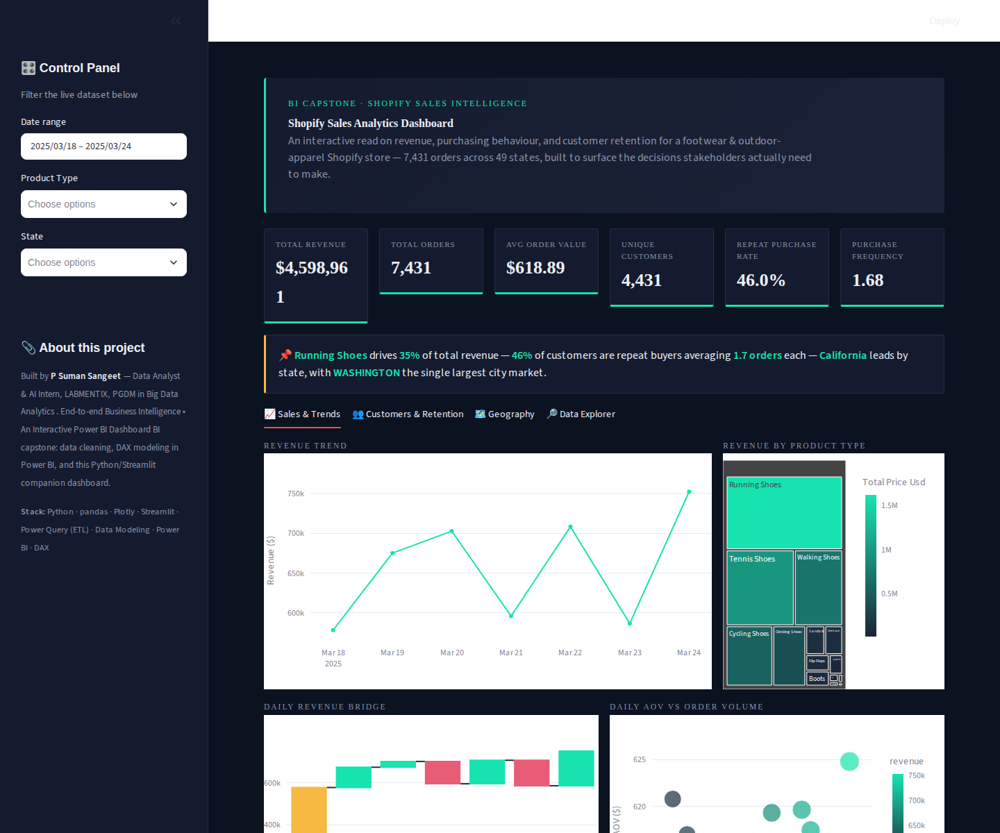
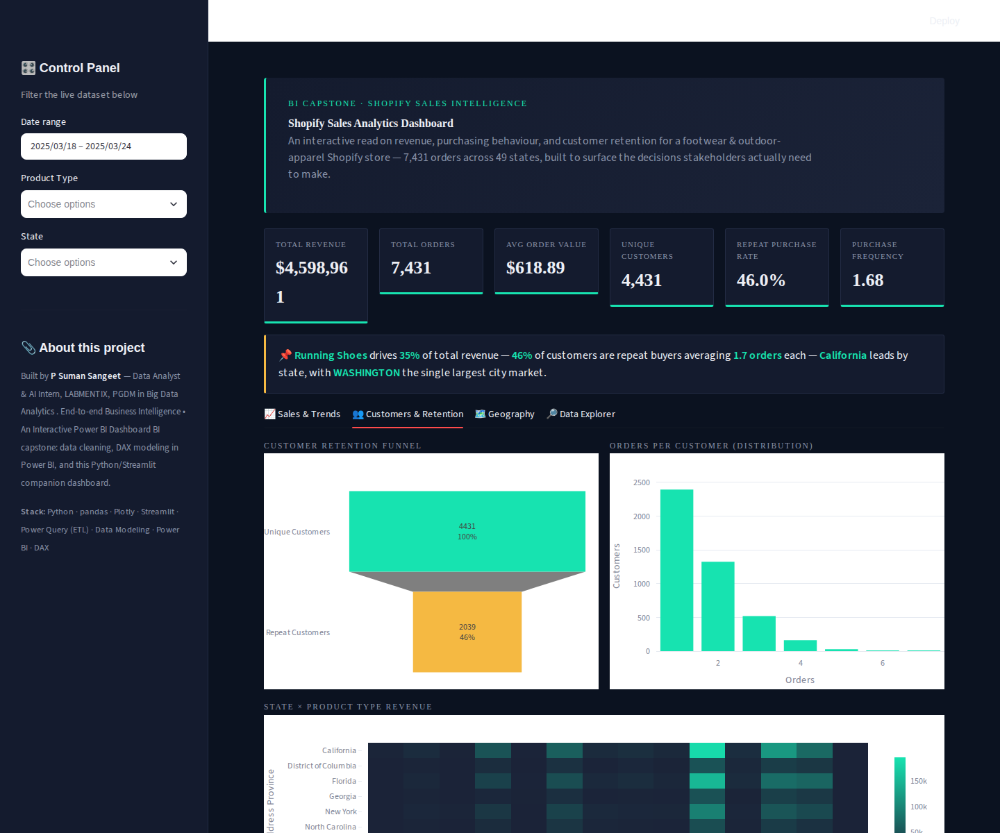
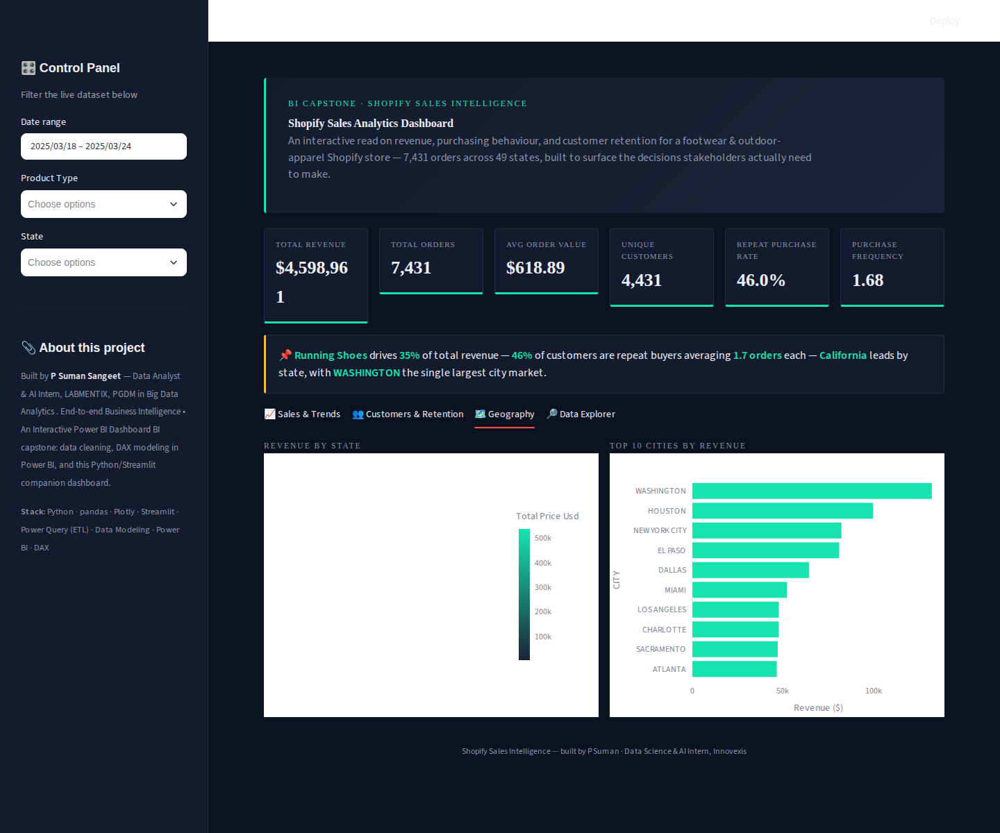

# 🏃 Shopify Sales Intelligence

**An interactive Power BI dashboard — with a live Python/Streamlit companion app — that turns a raw Shopify transaction export into a decision-ready view of revenue, purchasing behaviour, and customer retention.**

[](#)
[](#)
[](#)
[](#)
[](#)
[](#)
[](#license)

> **P Suman Sangeet** · Data Analyst & AI Intern, LabMentix · PGDM in Big Data Analytics

---

## 📌 Why this project

Most portfolio dashboards stop at "here's a chart." This one is built the way a BI analyst would deliver it to a real business: a proper **star-schema data model**, **15+ DAX measures**, a **27-visual, 2-page Power BI report**, and a set of **plain-language insights + recommendations** a store owner could act on tomorrow — plus a **browser-based Streamlit companion** so anyone reviewing this repo can explore the same insights without installing Power BI.

| | |
|---|---|
| **Dataset** | Shopify transactions export — 7,431 orders · 4,431 customers · 49 U.S. states |
| **Reporting window** | 18–24 March 2025 (7-day transaction snapshot) |
| **Deliverables** | `Shopify_Sales_Analytics_Dashboard.pbix` (Power BI) + `Wix_Shopify.py` (Streamlit) |
| **Stakeholders** | Store owner / GM, Marketing, Merchandising & Inventory planning |

---

## 🖥️ Live Dashboard (Streamlit companion)

The screenshots below are the actual running Streamlit app — built with the same KPIs, dimensions, and DAX-equivalent logic as the Power BI model — included here because it renders directly in a browser for anyone reviewing this repo.

**Sales & Trends** — hero header, live-filterable KPI scoreboard, auto-generated insight callout, revenue trend, product-type treemap, daily revenue waterfall, and an AOV-vs-volume scatter.



**Customers & Retention** — retention funnel (Unique → Repeat), orders-per-customer distribution, and a State × Product Type revenue heatmap.



**Geography** — revenue-by-state choropleth and Top 10 Cities by revenue.



```bash
# Run it yourself
pip install -r requirements.txt
streamlit run Wix_Shopify.py
```

---

## 🔢 Headline numbers

| Total Revenue | Total Orders | Avg. Order Value | Unique Customers | Repeat Purchase Rate | Purchase Frequency |
|:---:|:---:|:---:|:---:|:---:|:---:|
| **$4.60M** | **7,431** | **$618.89** | **4,431** | **46.0%** | **1.68 orders** |

---

## 🎯 Business questions the dashboard answers

- How much revenue are we generating, and how is it trending day over day?
- Which products and geographies drive the most (and least) revenue?
- When do customers actually shop — which days and hours should promotions target?
- What share of customers return, and how much more valuable are they than one-time buyers?
- Which customers should be prioritised for retention, and what is their long-term value?

---

## 💡 Key insights & recommendations

**1. Revenue is concentrated in footwear.**
Running Shoes alone drives **35.2% of total revenue** ($1.62M); the top three footwear categories (Running, Tennis, Walking Shoes) account for **71.3%** of sales combined. Accessories, Clogs, Boy's, and Water Shoes together generated just $30K (0.65% of revenue).
> **Recommendation:** Protect Running Shoes inventory availability above all other lines, test bundled promotions to cross-sell adjacent categories, and review merchandising investment in the bottom four categories.

**2. Repeat customers are the profit engine.**
46% of customers are repeat buyers, yet they generate **67.8% of total revenue** — nearly double their share of the customer base. At the same time, the top 10% of customers by spend account for only 21.9% of revenue, so retention isn't a small-VIP-tier problem.
> **Recommendation:** Build retention programs that reach the broad Loyal/At-Risk middle segment (62% of customers), not just top spenders.

**3. Demand is geographically concentrated.**
California, Texas, and Florida together contribute **31.9%** of revenue; at the city level, Washington D.C., Houston, and New York City are the top three markets.
> **Recommendation:** Prioritise regional marketing spend and fulfilment decisions around the top states/cities first.

**4. Shopping has a predictable rhythm.**
Monday ($752K) and Saturday ($708K) are the strongest revenue days, Tuesday ($578K) the weakest — roughly a 30% swing. Ordering activity is heavily concentrated in the **10 AM – 4 PM** window, peaking at 11 AM (568 orders, $349K).
> **Recommendation:** Shift ad spend, email sends, and flash-sale timing toward Monday/Saturday and the late-morning window, rather than spreading it evenly across the week.

**5. The data model is built to scale.**
The current export covers one week — every trend and growth claim is flagged as directionally sound but provisional pending more history. The star schema, DAX measures (including a `DATEADD`-based Revenue Growth % measure), and dashboard layout are already built to absorb additional months without redesign.
> **Recommendation:** Re-run this model monthly; Month-over-Month growth, cohort retention, and CLV will sharpen automatically as more transaction history loads.

---

## 🧱 Data model & ETL

Built as a **star schema** in Power BI so DAX measures aggregate cleanly and every slicer cross-filters every visual on the page.

```
Dim_Date ──┐
Dim_Product ─┼──> Fact_Orders (7,431 rows, 1 row = 1 order) <──┼── Dim_Customer
Dim_Geography ┘                                                └── (derived: first-purchase date, order count)
```

- **Fact_Orders** — the cleaned Shopify export.
- **Dim_Date** — dedicated calendar table, marked as the official Date table, so Power BI's time-intelligence functions (`TOTALMTD`, `DATEADD`, `SAMEPERIODLASTYEAR`) work correctly.
- **Dim_Product / Dim_Customer / Dim_Geography** — distinct lookup tables related on Product Type, Customer Id, and City/State.

**Power Query cleaning steps:**
- Type correction — `Invoice Date` → Date/Time, price/tax fields → Fixed Decimal, ID fields → Whole Number.
- Text standardisation — City/State casing normalised (e.g. `houston`/`HOUSTON` → `Houston`) to prevent duplicate groups.
- Verified `Order Number` is unique across all 7,431 rows with zero nulls in any column — no imputation required.
- Helper columns added: Order Date, Order Month, Day of Week, Hour of Day, and a First-vs-Repeat-Order flag.

**Sample DAX measures:**

```DAX
Total Revenue   = SUM ( Fact_Orders[Total Price Usd] )
Total Orders    = DISTINCTCOUNT ( Fact_Orders[Order Number] )
AOV             = DIVIDE ( [Total Revenue], [Total Orders], 0 )

Revenue Growth % =
VAR PrevRevenue = CALCULATE ( [Total Revenue], DATEADD ( Dim_Date[Date], -1, MONTH ) )
RETURN DIVIDE ( [Total Revenue] - PrevRevenue, PrevRevenue )
```

15+ measures in total, covering Total Revenue, Total Orders, AOV, Repeat Purchase Rate, Purchase Frequency, Customer Lifetime Value (CLV), and Revenue Growth %.

---

## 📊 Full visual inventory (Power BI — 27 visuals across 2 pages)

**Page 1 — Sales & Retention Overview** (19 visuals)

| Visual type | Fields / measures | What it answers |
|---|---|---|
| KPI cards | Total Revenue, Total Orders, AOV, Unique Customers | Headline numbers, answerable in seconds |
| KPI visual | Revenue Growth % | Trend-aware KPI with target/status formatting |
| Column charts | Revenue per Customer, CLV, Repeat Purchase Rate | Distribution of key per-customer metrics |
| Line chart | Total Revenue by Month/Year | Revenue trend over time |
| Clustered bar chart | Total Revenue by Product Type | Product-level revenue ranking |
| Donut chart | Customer Count by City | Geographic customer concentration |
| Table | Customer count, revenue, orders | Row-level detail for analysts |
| Cards | Repeat Customers, Purchase Frequency | Retention-focused KPIs |
| Slicers (×4) | Month/Year, Product Type, Customer Id, City | Cross-filter every visual on the page at once |

**Page 2 — Insights & Trends** (8 visuals)

| Visual type | Fields / measures | What it answers |
|---|---|---|
| Treemap | Product Type × Total Revenue | Proportional view of top revenue drivers |
| Ribbon chart | Month/Year × Product Type × Revenue | Which product ranks #1 each period |
| Scatter chart | AOV × Total Orders, sized by Revenue | Flags high-volume/low-value vs. reverse periods |
| Filled map | City × Total Revenue | Geographic revenue concentration |
| Waterfall chart | Month/Year × Total Revenue | Period-over-period revenue bridge |
| Funnel | Unique Customers → Repeat Customers | Retention drop-off at a glance |
| Matrix | City × Product Type × Revenue | Cross-tab of the two key segment dimensions |
| Gauge | Revenue Growth % vs. target | Target-tracking for leadership review |

Every visual is chosen deliberately per business question rather than defaulted to, and both pages share one data model — filtering one visual updates every other visual consistently.

---

## 🛠️ Tools & skills demonstrated

- **Data cleaning & ETL** — Power Query: type correction, deduplication, text standardisation on a 7,431-row transactional export.
- **Data modeling** — Star schema (`Fact_Orders` + `Dim_Customer`, `Dim_Product`, `Dim_Date`, `Dim_Geography`) with a marked Date table for correct time-intelligence behaviour.
- **DAX** — 15+ measures including Total Revenue, AOV, Repeat Purchase Rate, CLV, and a `DATEADD`-based Revenue Growth % measure.
- **Power BI visualization** — 27 visuals across two pages: cards, KPI, line, bar, treemap, ribbon, scatter, map, waterfall, funnel, matrix, and gauge.
- **Python** — `pandas` for analysis, `Plotly` for charting, and a custom-themed `Streamlit` app (custom CSS, multi-tab layout, cross-filtering) deployed as a standalone interactive product.
- **Applied analytics** — RFM customer segmentation and a documented-assumption CLV model, both built to re-calibrate automatically as more transaction history is loaded.

---

## 📁 Repository structure

```
├── Shopify_Sales_Analytics_Dashboard.pbix   # Power BI report (2 pages, 27 visuals, 15+ DAX measures)
├── Wix_Shopify.py                           # Streamlit companion dashboard
├── shopify_data.csv                         # Cleaned transaction-level dataset (7,431 rows)
├── Shopify_Sales.xlsx                       # Source/working data in Excel
├── docs/
│   ├── Shopify_Sales_BI_Report.docx         # Full written BI report (stages, DAX, insights)
│   └── Shopify_Store_Owner_Briefing.pptx    # Stakeholder-facing summary deck
├── screenshots/                             # Dashboard screenshots used in this README
└── requirements.txt
```

## 🗂️ Data dictionary

`shopify_data.csv` — one row per order, 10 columns, zero nulls after cleaning:

| Column | Type | Description |
|---|---|---|
| `Order Number` | Whole number | Unique order identifier (fact table primary key) |
| `Customer Id` | Whole number | Unique customer identifier |
| `Invoice Date` | Date/Time | Timestamp of the order |
| `Product Type` | Text | Product category (14 distinct values, e.g. Running Shoes, Boots) |
| `Quantity` | Whole number | Units purchased on the order |
| `CITY` | Text | Customer's billing city |
| `Billing Address Province` | Text | Customer's billing U.S. state |
| `Subtotal Price` | Decimal | Pre-tax order value (USD) |
| `Total Price Usd` | Decimal | Post-tax order value (USD) |
| `Total Tax` | Decimal | Tax amount (USD) |

---

## ▶️ Getting started

```bash
# 1. Clone the repo
git clone https://github.com/<your-username>/shopify-sales-intelligence.git
cd shopify-sales-intelligence

# 2. Set up the Streamlit companion dashboard
pip install -r requirements.txt
streamlit run Wix_Shopify.py

# 3. Explore the Power BI report
# Open Shopify_Sales_Analytics_Dashboard.pbix in Power BI Desktop
```

**`requirements.txt`**
```
streamlit
pandas
plotly
```

---

## ⚠️ Data scope & limitations

The source export covers **18–24 March 2025** — one week of transactions. Every trend and growth claim in this project is directionally sound but flagged as **provisional** pending a full month or more of transaction history. The data model, DAX measures, and dashboard layout are already built to absorb that history without redesign — Month-over-Month growth, cohort retention, and CLV measures are wired up and ready to populate automatically as more data lands.

---

## 👤 About the author

**P Suman Sangeet** — Data Analyst & AI Intern, LabMentix. PGDM in Big Data Analytics.

- 💼 LinkedIn: `<add your LinkedIn URL>`
- 📧 Email: `<add your email>`
- 🌐 Portfolio: `<add your portfolio URL>`

If you're a recruiter or hiring manager reviewing this project, the fastest way in is: **screenshots above → headline numbers → 5 key insights**. Everything else in this README is the supporting detail.

## 📄 License

This project is available under the [MIT License](LICENSE). The underlying transaction data is a synthetic/sample Shopify export used for portfolio purposes only.
