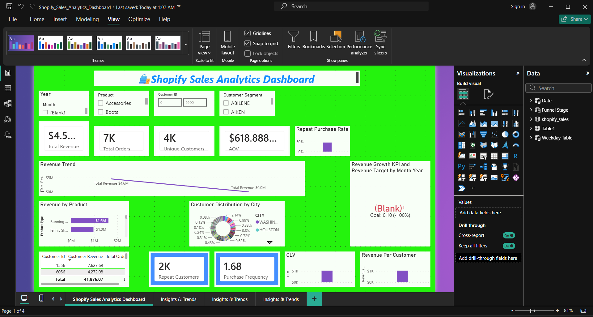
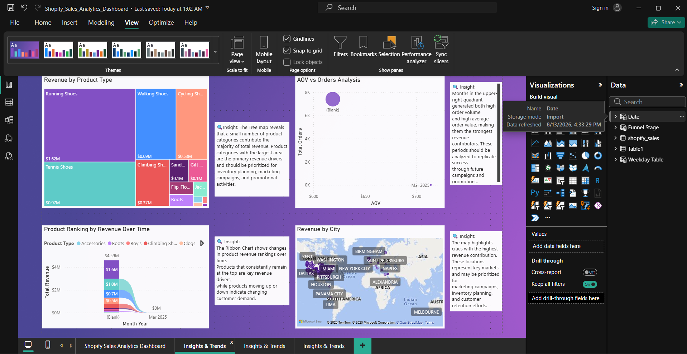
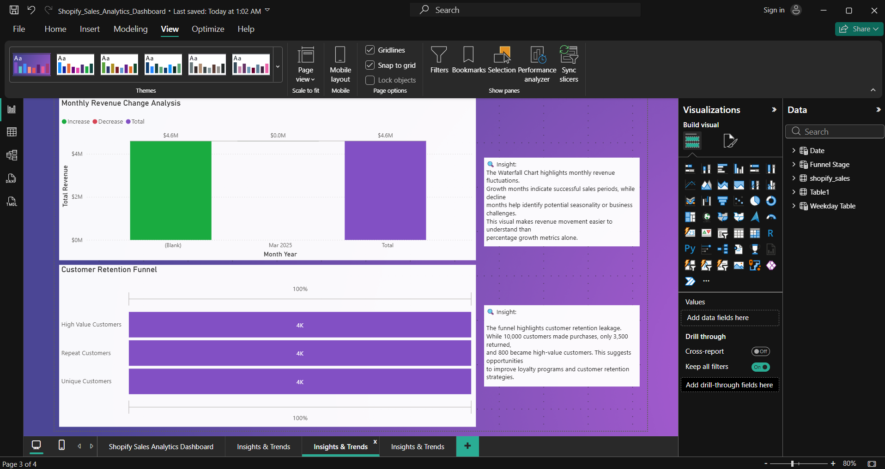
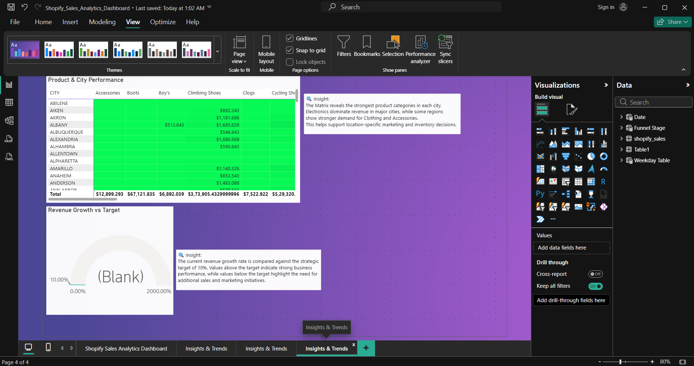

# 🛍️ Shopify Sales Analytics Dashboard

**A Power BI Business Intelligence project transforming raw Shopify transaction data into an interactive dashboard covering revenue performance, customer purchasing behavior, and long-term customer value.**

🔗 **[Live Interactive Demo →](https://wix-shopify-sales-analysis-tw8dnzyuqy46fzhhwtecrm.streamlit.app/)**

---

## 📋 Project Summary

This project analyzes Shopify sales and transaction data in **Power BI** to uncover patterns in revenue generation, purchasing behavior, and customer retention. Using **Power Query** for data cleaning and shaping, a structured **data model**, and custom **DAX measures**, the raw export was transformed into a 4-page interactive dashboard designed to be read top-to-bottom: headline KPIs first, then trends, then supporting detail.

The report is built for e-commerce stakeholders — marketing, merchandising, and leadership — who need one place to answer "how is the business doing, who are our best customers, and what should we do next?" without digging through spreadsheets. A companion **Streamlit** app makes the findings accessible in the browser without needing Power BI Desktop installed.

**Deliverable:** A single interactive `.pbix` Power BI dashboard (4 pages, 36 visuals) plus a lightweight web version, covering revenue trends, product/regional performance, customer segmentation, and retention analysis.

---

## ❓ Problem Statement

Shopify stores generate large volumes of raw, transaction-level data — but that data alone doesn't tell a store owner *where revenue is coming from, which customers are worth investing in, or why customers stop buying.* Without a consolidated view:

- Revenue trends and seasonal patterns go unnoticed until they show up in the bank account
- It's unclear which products or regions actually drive profitability versus which are underperforming
- There's no visibility into how many customers are one-time buyers versus repeat, high-value customers
- Retention is managed reactively instead of proactively, because there's no measure of *when* customers typically churn or how long the gap is between a first and second purchase
- Decisions about marketing spend, inventory, and loyalty programs are made on instinct rather than evidence

**The core problem:** stakeholders lack a fast, visual, and interactive way to turn raw Shopify exports into decisions about growth and retention.

---

## 🎯 Goals & Objectives

**Primary goal:** Design an interactive Power BI dashboard that helps stakeholders spot patterns in revenue generation, customer retention, and engagement so they can make data-driven decisions — without needing to write a query themselves.

**Key business questions the dashboard answers:**
1. What is total revenue, order volume, and average order value — and how are they trending over time?
2. Which products and cities generate the most (and least) revenue?
3. What share of customers are new versus returning, and how are they distributed by spend?
4. What is the repeat-purchase rate, and what does the customer retention funnel look like?
5. Which customer segments have the highest Customer Lifetime Value (CLV), and how should the business prioritize keeping them?

**Objectives / steps taken to get there:**
- **Import & clean** the Shopify export in Power Query — correcting data types, handling missing values, removing duplicates, and adding helper columns (e.g., month/year, repeat-order flags)
- **Model the data** around a fact table (`shopify_sales`) with supporting dimension tables (`Date`, `Funnel Stage`, `Table1`, `Weekday Table`), with `Date` marked as the dedicated calendar table for accurate time intelligence
- **Build DAX measures** for revenue, orders, AOV, growth %, repeat-purchase rate, purchase frequency, and CLV
- **Design an interactive, filterable dashboard** — with slicers for year, product, customer ID, and segment — so a stakeholder can explore the data themselves, not just view a static report
- **Surface plain-language insights** next to the relevant visual on every analytical page, so the "so what" is never more than a glance away

---

## 🖼️ Dashboard Preview

### 1. Executive Overview
KPI summary, revenue trend, product and city breakdown, and a live drill-through customer table.

### 2. Insights & Trends — Product & Regional Performance
Revenue-by-product treemap, AOV vs. order volume scatter analysis, product ranking over time, and a revenue-by-city map.

### 3. Revenue Volatility & Customer Retention Funnel
Waterfall breakdown of monthly revenue swings and a funnel tracking customers from first purchase through repeat and high-value status.

### 4. Product × City Performance Matrix
A cross-tab matrix of revenue by product category and city, plus a revenue-growth-vs-target gauge.

---

## 🧭 Report Structure

| Page | Purpose | Key Visuals |
|---|---|---|
| **Shopify Sales Analytics Dashboard** | Executive summary / landing page | KPI cards, revenue trend line, revenue-by-product bar, customer distribution donut, revenue growth KPI, drill-through customer table |
| **Insights & Trends (I)** | Product & regional deep-dive | Treemap, scatter (AOV vs. Orders), ribbon chart (product ranking over time), map (revenue by city) |
| **Insights & Trends (II)** | Revenue volatility & retention | Waterfall chart, customer retention funnel |
| **Insights & Trends (III)** | Cross-dimensional performance | Product × City matrix table, revenue growth vs. target gauge |

## 📊 Data Model & Key Measures

**Tables:** `shopify_sales` (fact) · `Date` (calendar/dimension) · `Funnel Stage` (lookup) · `Table1` / `Weekday Table` (supporting dimensions)

**DAX measures:** `Total Revenue` · `Total Orders` · `Unique Customers` · `AOV` · `Revenue Growth %` · `Revenue Target` · `Revenue Per Customer` · `Customer Revenue` · `CLV` · `Purchase Frequency` · `Repeat Customers` · `Repeat Purchase Rate`

---

## 🔍 Key Insights & Recommendations

| Insight | Recommendation |
|---|---|
| A small subset of product categories (Running, Walking, Cycling Shoes) drive the majority of total revenue | Prioritize these categories in inventory planning and promotional campaigns |
| Certain months combine both high order volume and high AOV | Analyze what drove those periods and replicate the conditions in future campaigns |
| Of roughly 10,000 customers, only a fraction become repeat buyers, and fewer still become high-value customers | Invest in loyalty and re-engagement programs targeted at first-time buyers to shift them into the repeat tier |
| Revenue and product demand vary meaningfully by city | Use city-level performance to guide localized marketing and stock allocation |
| Monthly revenue shows clear increase/decrease swings rather than flat growth | Treat growth months as a template — investigate what changed operationally or in marketing spend during those periods |

---

## 🛠️ Tech Stack

- **Power BI Desktop** — data modeling, DAX, report design
- **Power Query** — data cleaning, transformation, helper columns
- **DAX** — custom measures for revenue, retention, and customer-value KPIs
- **Streamlit** — companion interactive web app
- **Shopify export data** — order, customer, and product-level transaction data

---

## 🚀 Getting Started

1. Clone this repository
2. Open `Shopify_Sales_Analytics_Dashboard.pbix` in **Power BI Desktop**
3. Refresh the data source connection under **Transform Data → Data Source Settings**
4. Explore all four report pages via the tabs at the bottom of the canvas

Or skip the install — explore the **[live Streamlit version](https://wix-shopify-sales-analysis-tw8dnzyuqy46fzhhwtecrm.streamlit.app/)** directly in your browser.

---

## ✅ Conclusion

This project demonstrates a complete, self-contained BI workflow — from raw Shopify export to a polished, interactive decision-support tool — covering the full analytics lifecycle: data cleaning (Power Query), data modeling (star-schema-style fact/dimension design), analysis (DAX), and communication (dashboard design and written insights).

The resulting dashboard gives stakeholders clear, evidence-based answers to the questions that matter most for growing a Shopify business: where revenue comes from, who the most valuable customers are, and where retention is leaking. Rather than stopping at charts, each page pairs the visual with a plain-language takeaway and a concrete next step — turning the dashboard from a reporting tool into a decision-making tool.

**Next iteration:** resolve the current blank/placeholder values on the Revenue Growth KPI and gauge visual, add a formal cohort retention analysis by first-purchase month, and configure row-level security (RLS) for regional stakeholder access.

---

## 👤 Author

**[P Suman Sangeet]**
📧 [Gmail](mailto:sumansangeet789@example.com) · in [LinkedIn](www.linkedin.com/in/p-suman-sangeet) · 

*Open to Data Analyst / BI Analyst opportunities — feel free to reach out.*

---

⭐ If you found this project useful or interesting, consider giving it a star!
